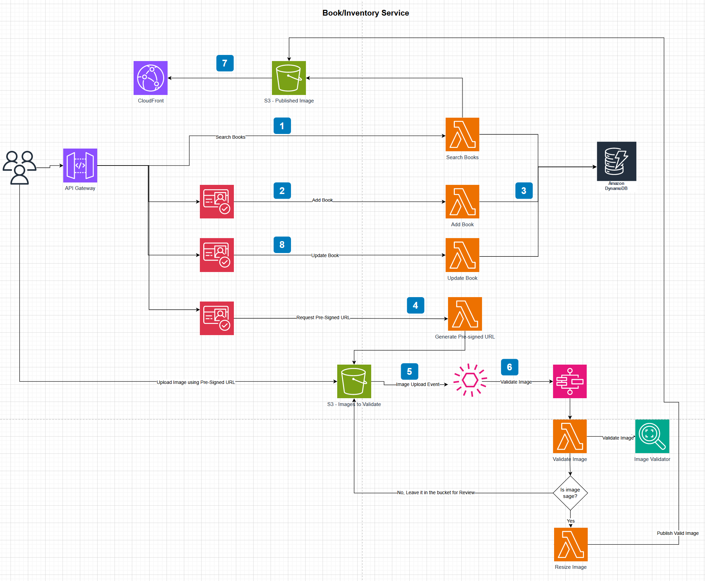

## Bob's Used BookStore Serverless
Bob's Used BookStore serverless is a serverless version of the [Bob's Used Books Sample Application](https://github.com/aws-samples/bobs-used-bookstore-sample).
This sample application is to demonstrate modernizing dotnet api in serverless framework with cdk.

## Overview 
In this sample dotnet modernization, microservices are identified. As a first step, BookInventory service is implemented with Cognito integration.

### Architecture

Book Inventory microservice uses Api Gateway -> Lambda -> DynamoDB. Cognito is integrated with Api gateway with custom lambda authorizer to check if the requester has necessary roles to access the endpoint.



1. **Search Book** -> Search book api can be used by Admin, Registered Customer and by anonymous users. So Search Api is not integrated with Cognito Authorizer. 
2. **Add Book** -> Add Book Api is restricted to only users. Lambda authorizer checks if the requester has "Customer" role
3. **Lambda** -> Lambda functions are built with [Lambda Annotation Framework](https://aws.amazon.com/blogs/developer/net-lambda-annotations-framework/) and [Lambda power tools](https://docs.powertools.aws.dev/lambda/dotnet/). Implemented Lambda functions demonstrates patterns to use CloudWatch for logging, XRay for Tracing and Custom metrics. Lambda function interacts with NoSQL DynamoDB for storing data
4. **Cover page Image Upload** -> Pre-signed Url is generated to upload cover page image to S3. Only Customer role is allowed to upload image. Uploaded images for one book are stored under book id folder in the bucket for easy access
5. **S3 Event Notification** -> S3 event notification triggers image validation process asynchronously as soon as the image is uploaded through EventBridge Rule
6. **EventBridge Rules and Step Function** -> Events filters are applied to send only new object creation events for images (.jpg and .png) to trigger step function to validate image. Step function checks if the image does not have violent/sexual content using Rekognition Service. If the image is safe, it will resize image. Otherwise, image is left in s3 bucket for review. It can be enhanced to add notification/move to different bucket depends on the need
7. **Publish Image** -> Safe images are resized and saved in separate bucket where all the images are validated to use in frontend. Original images are deleted after publish. CloudFront is used to expose the images from published bucket for the frontend to use
8. **Update Book** -> Update book api follows same pattern as AddBook. Both Admin and Customer roles can access UpdateBook Api


## Prerequisites
To run and debug the application locally you need the following:
* The [.NET 8 SDK](https://dotnet.microsoft.com/en-us/download/dotnet/8.0)
* A modern IDE, for example [Visual Studio Code](https://code.visualstudio.com/) or [Visual Studio 2022](https://visualstudio.microsoft.com/vs/) or [JetBrains Rider](https://www.jetbrains.com/rider/)

To deploy the application to AWS you need the following:
* An AWS IAM User with an attached _AdministratorAccess_ policy
* The [AWS Cloud Development Kit (CDK)](https://docs.aws.amazon.com/cdk/v2/guide/getting_started.html)
* [Bootstrap](https://docs.aws.amazon.com/cdk/v2/guide/bootstrapping.html) your AWS environment for the AWS CDK by executing `cdk bootstrap` in a terminal window

## Getting started
1. AuthenticationStack - Authentication Stack configures Cognito user pool "book-store-users". It will also create user groups "Admin" and "Customer".
2. BookInventoryServiceStack - BookInventoryServiceStack deploys Api gateway with lambda and dynamoDb as the data store. Cognito user pool created in "AuthenticationStack" is used for authentication and authorization in api gateway.

## Deployment
Bookstore application can be deployed to AWS via the CDK's command-line tooling. BookInventoryServiceStack depends on the resources created by AuthenticationStack. 

```
cdk deploy AuthenticationStack --require-approval=never --app "dotnet run --project cdk/src/AuthenticationStack/AuthenticationStack.csproj"
```
```
cdk deploy BookInventoryServiceStack --require-approval=never --app "dotnet run --project cdk/src/BookInventoryApiStack/BookInventoryApiStack.csproj"
```
## Postfix Environment
When a team of developers developing a same application, may want to test the feature/change in an isolated 
environment without impacting other developers. So the developer can create postfix environment which will create 
all the resources with postfix to test developer's change in isolated postfix environment. 
After successful testing, code can be merged to main/dev branch to deploy tested code. Postfix environment can be 
destroyed after testing.   

### Bash
```
export STACK_POSTFIX=""
cdk deploy $"AuthenticationStack{STACK_POSTFIX}" --require-approval=never --app "dotnet run --project cdk/src/AuthenticationStack/AuthenticationStack.csproj"
cdk deploy $"BookInventoryServiceStack{STACK_POSTFIX}" --require-approval=never --app "dotnet run --project cdk/src/BookInventoryApiStack/BookInventoryApiStack.csproj"
```
### Windows
```
$Env:STACK_POSTFIX=""
cdk deploy AuthenticationStack$Env:STACK_POSTFIX --require-approval=never --app "dotnet run --project cdk/src/AuthenticationStack/AuthenticationStack.csproj"
cdk deploy BookInventoryServiceStack$Env:STACK_POSTFIX --require-approval=never --app "dotnet run --project cdk/src/BookInventoryApiStack/BookInventoryApiStack.csproj"
```

## How to test

The following microservices are used while building BookStore serverless:

1. Setup user in cognito
   * Create new user 
   ```
   aws cognito-idp admin-create-user --user-pool-id <USER_POOL_ID> --username john@example.com --user-attributes Name="given_name",Value="john" Name="family_name",Value="smith"
   ```
   * Setup password to the user
   ```
   aws cognito-idp admin-set-user-password --user-pool-id <USER_POOL_ID> --username john@example.com --password "<PASSWORD>" --permanent
   ```
   * Assign role to the user in Cognito
     * Login to aws console. Select Cognito Service and select the user pool
     * Select the user created under the user pool
     * Go to "Group memberships". Add/Remove to the group
   * Get Id token (Api Gateway Lambda authorizer fetches role information from Id token)
   ```
   aws cognito-idp admin-initiate-auth --cli-input-json file://auth.json
   ```
   **auth.json**
   ```json
   {
       "UserPoolId": "<USER_POOl_ID>",
       "ClientId": "<CLIENT_ID>",
       "AuthFlow": "ADMIN_NO_SRP_AUTH",
       "AuthParameters": {
           "USERNAME": "john@example.com",
           "PASSWORD": "<PASSWORD>"
       }
   }
   ```
2. Use Api Test tools such as postman to test Book Inventory. Take Book Inventory Api Url from stack output  
   **Add Book**
   * It is POST method, 
   * "Customer" is allowed to access
   * Requires Authorization header with Id token (No need of Bearer infront of Id token)
   ````
   POST https://{{api_gateway_url}}/books
   ````   
   * Request body
   ````
   {
    "name": "2020: The Apocalypse",
    "author": "Li Juan",
    "bookType": "Hardcover",
    "condition": "Like New",
    "genre": "Mystery, Thriller & Suspense",
    "publisher": "Astral Publishing",
    "year": 2024,
    "isbn": "6556784356",
    "summary": "Bobs used book serverless",
    "price": 5,
    "quantity": 10
    }
   ````
   
   **Update Book**
   * It is PUT method
   * "Customer" and "Admin" roles are allowed to access
   * Requires Authorization header with Id token (No need of Bearer infront of Id token)
   ````
   POST https://{{api_gateway_url}}/books
   ````   
   * Request body
   ````
   {
    "bookId": "8274dcb1-e651-41b4-98c6-d416e8b59fab",
    "name": "2020: The Apocalypse",
    "author": "Li Juan",
    "bookType": "Hardcover",
    "condition": "Like New",
    "genre": "Mystery, Thriller & Suspense",
    "publisher": "Astral Publishing",
    "year": 2024,
    "isbn": "6556784356",
    "summary": "Bobs used book serverless",
    "price": 5,
    "quantity": 10
    }
   ````
   
   **Search Book**
   * Replace book uid in the url. Authorization header is optional as this endpoint allows no specific role required
     ````
     GET https://{{api_gateway_url}}/books/{{search_uid}}
     ````
   
   **List Books**
   * Authorization header is optional as this endpoint allows no specific role required
     ````
     GET https://{{api_gateway_url}}/books?pageSize=2&cursor=null 
     ````
   * Set pageSize for the response. If the data in the response exceeds pageSize, response will provide cursor for next call. Use the cursor value in the next call to query next page
   * Set cursor - null for first call; Take cursor from the response for next page
   * If the response has cursor = "", then the search reached end of all the pages
   

   **Pre-signed url to upload cover page image to S3 bucket**
   * Add Book id and file name to upload
   * "Customer" role is allowed to access
   * Requires Authorization header with Id token (No need of Bearer infront of Id token)
   ````
   GET https://{{api_gateway_url}}/books/{id}/{fileName}
   ````
   
3. Upload .png/.jpg image to S3 using presigned url. After validation, it will be moved to published image bucket. It can be accessed through cloudFront
   
## Deleting the resources

When you have completed working with the sample applications we recommend deleting the resources to avoid possible charges. To do this, either:

* In a terminal window navigate to the solution folder and run the command
```
cdk destroy BookInventoryServiceStack --require-approval=never --app "dotnet run --project cdk/src/BookInventoryApiStack/BookInventoryApiStack.csproj"
```
```
cdk destroy AuthenticationStack --require-approval=never --app "dotnet run --project cdk/src/AuthenticationStack/AuthenticationStack.csproj"
```
or
* Navigate to the CloudFormation dashboard in the AWS Management Console and delete all Bob's Used BookStore Serverless stacks.

## Security

See [CONTRIBUTING](CONTRIBUTING.md#security-issue-notifications) for more information.

## License

This library is licensed under the MIT-0 License. See the LICENSE file.

