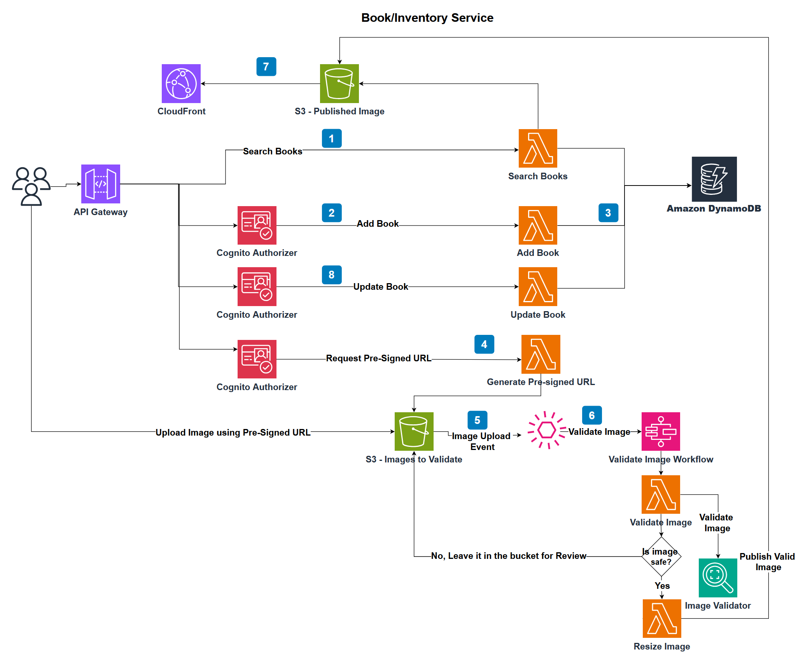

## Bob's Used BookStore Serverless
Bob's Used BookStore serverless is a serverless version of the [Bob's Used Books Sample Application](https://github.com/aws-samples/bobs-used-bookstore-sample).
This sample application is to demonstrate modernizing dotnet API by leveraging the serverless framework with [AWS Cloud Development Kit (CDK)](https://docs.aws.amazon.com/cdk/v2/guide/getting_started.html).

## Overview 
In this dotnet modernization sample, microservices are identified as the first step. BookInventory is the one of the microservices implemented with Amazon Cognito integration.

### BookInventory Architecture

The BookInventory microservice utilizes various serverless services from AWS, including AWS Lambda, Amazon API Gateway, Amazon DynamoDB, Amazon S3 buckets, and Step Functions. Amazon Cognito is integrated with the API Gateway using a Custom Lambda authorizer to verify if the requester has the necessary roles to access the endpoint.



- **AWS Lambda** - Lambda functions are built with [Lambda Annotation Framework](https://aws.amazon.com/blogs/developer/net-lambda-annotations-framework/) and [Lambda power tools](https://docs.powertools.aws.dev/lambda/dotnet/). Implemented Lambda functions demonstrates patterns to use CloudWatch for logging, XRay for Tracing and Custom metrics. Lambda function interacts with Amazon DynamoDB for storing data.
    - **ListBook and SearchBook** APIs can be used by Admin, Customer and by anonymous users.
    - **Add Book** API is restricted to only authorized users. Lambda authorizer checks if the requester has "Customer" role.
    - **Update Book** API is restricted to only authorized users. Lambda authorizer checks if the requester has "Customer" or "Admin" role.
    - **Cover page Image Upload** API generates presigned URLs to upload cover page image to Amazon S3 bucket. Only "Customer" role is allowed to upload image. Uploaded images for book are stored under book id folder in the bucket for easy access.

- **S3 Event Notification** triggers image validation process asynchronously as soon as the image is uploaded to S3 bucket.
- **Step Function and EventBridge Rules** filters are applied to send only new object creation events for images (.jpg and .png) to trigger step function to validate image. Step function checks if the image does not have violent or sexual content using Amazon Rekognition Service.  If the image is safe, another Lambda function resizes it. Otherwise, the image remains in the S3 bucket for manual review. Additionally, this process can be enhanced to include notifications or move the image to a different bucket based on specific requirements
- **Amazon S3**
    - **Publish Image bucket** is used to store all the validated and resized images that can be used in the frontend application. After the images are published to this bucket, the original images are typically deleted from the source location. This helps optimize storage and reduce costs. CloudFront is used to expose the published images from the S3 bucket to the frontend application.
- **Amazon DynamoDB** table is used to store BookInventory microservice data.


## Prerequisites
To run and debug the application locally you need the following:
* The [.NET 8 SDK](https://dotnet.microsoft.com/en-us/download/dotnet/8.0)
* A modern IDE, for example [Visual Studio Code](https://code.visualstudio.com/) or [Visual Studio 2022](https://visualstudio.microsoft.com/vs/) or [JetBrains Rider](https://www.jetbrains.com/rider/)

To deploy the application to AWS you need the following:
* An AWS IAM User with an attached _AdministratorAccess_ policy. AdministratorAccess is only recommended for sample application. It is recommended to grant only required policies. 
* The [AWS Cloud Development Kit (CDK)](https://docs.aws.amazon.com/cdk/v2/guide/getting_started.html)
* [Bootstrap](https://docs.aws.amazon.com/cdk/v2/guide/bootstrapping.html) your AWS environment for the AWS CDK by executing `cdk bootstrap` in a terminal window

## Getting started
1. AuthenticationStack - Authentication Stack configures Cognito user pool "book-store-users". It will also create user groups "Admin" and "Customer".
2. BookInventoryServiceStack - BookInventoryServiceStack deploys Api gateway with Lambda functions and DynamoDB as the data store. Cognito user pool created in "AuthenticationStack" is used for authentication and authorization in API Gateway.

## Deployment
Bookstore application can be deployed to AWS via the CDK's command-line tooling. BookInventoryServiceStack depends on the resources created by AuthenticationStack. 

```
cdk deploy AuthenticationStack --require-approval=never --app "dotnet run --project cdk/src/AuthenticationStack/AuthenticationStack.csproj"
```
```
cdk deploy BookInventoryServiceStack --require-approval=never --app "dotnet run --project cdk/src/BookInventoryApiStack/BookInventoryApiStack.csproj"
```
## Postfix Environment
When a team of developers developing an Application, may want to test the feature/change in an isolated 
environment without impacting the work of other developers. In such cases, a developer can create an isolated testing environment, which will create all the necessary resources with a specific postfix (suffix). This allows the developer to test their changes in an isolated environment. After successful testing, the code can be merged into the main or development branch. The isolated testing environment can be destroyed after the testing is complete.

Keep the postfix in two or 3 chars to make it simple to identify the resources. Example, -ab will suffix -ab in all the resources. 

### Bash
```
export STACK_POSTFIX="<<-simple-suffix-value>>"
cdk deploy $"AuthenticationStack{STACK_POSTFIX}" --require-approval=never --app "dotnet run --project cdk/src/AuthenticationStack/AuthenticationStack.csproj"
cdk deploy $"BookInventoryServiceStack{STACK_POSTFIX}" --require-approval=never --app "dotnet run --project cdk/src/BookInventoryApiStack/BookInventoryApiStack.csproj"
```
### Windows
```
$Env:STACK_POSTFIX="<<-simple-suffix-value>>"
cdk deploy AuthenticationStack$Env:STACK_POSTFIX --require-approval=never --app "dotnet run --project cdk/src/AuthenticationStack/AuthenticationStack.csproj"
cdk deploy BookInventoryServiceStack$Env:STACK_POSTFIX --require-approval=never --app "dotnet run --project cdk/src/BookInventoryApiStack/BookInventoryApiStack.csproj"
```

## How to test

Follow the steps given below to test BookStore application:

1. Setup user in cognito
   * Create new user 
   ```
   aws cognito-idp admin-create-user --user-pool-id <USER_POOL_ID> --username john@example.com --user-attributes Name="given_name",Value="john" Name="family_name",Value="smith"
   ```
   * Setup password to the user
   ```
   aws cognito-idp admin-set-user-password --user-pool-id <USER_POOL_ID> --username john@example.com --password "<PASSWORD>" --permanent
   ```
   * Assign role to the user in Cognito
     * Login to aws console. Select Cognito Service and select the user pool
     * Select the user created under the user pool
     * Go to "Group memberships". Add/Remove to the group
   * Get Id token (Api Gateway Lambda authorizer fetches role information from Id token)
   ```
   aws cognito-idp admin-initiate-auth --cli-input-json file://auth.json
   ```
   **auth.json**
   ```json
   {
       "UserPoolId": "<USER_POOl_ID>",
       "ClientId": "<CLIENT_ID>",
       "AuthFlow": "ADMIN_NO_SRP_AUTH",
       "AuthParameters": {
           "USERNAME": "john@example.com",
           "PASSWORD": "<PASSWORD>"
       }
   }
   ```
2. Use API Test tools such as postman to test Book Inventory. Take Book Inventory API Url from CloudFormation output  
   **Add Book**
   * It is POST method, 
   * "Customer" is allowed to access
   * Requires Authorization header with Id token (Do not include any keyword infront of the Id token)
   ````
   POST https://{{api_gateway_url}}/books
   ````   
   * Request body
   ````
   {
    "name": "2020: The Apocalypse",
    "author": "Li Juan",
    "bookType": "Hardcover",
    "condition": "Like New",
    "genre": "Mystery, Thriller & Suspense",
    "publisher": "Astral Publishing",
    "year": 2024,
    "isbn": "6556784356",
    "summary": "Bobs used book serverless",
    "price": 5,
    "quantity": 10
    }
   ````
   
   **Update Book**
   * It is PUT method
   * "Customer" and "Admin" roles are allowed to access
   * Requires Authorization header with Id token (Do not include any keyword infront of the Id token)
   ````
   PUT https://{{api_gateway_url}}/books
   ````   
   * Request body
   ````
   {
    "bookId": "8274dcb1-e651-41b4-98c6-d416e8b59fab",
    "name": "2020: The Apocalypse",
    "author": "Li Juan",
    "bookType": "Hardcover",
    "condition": "Like New",
    "genre": "Mystery, Thriller & Suspense",
    "publisher": "Astral Publishing",
    "year": 2024,
    "isbn": "6556784356",
    "summary": "Bobs used book serverless",
    "price": 5,
    "quantity": 10
    }
   ````
   
   **Search Book**
   * Replace book uid in the url. Authorization header is optional as this endpoint allows no specific role required
     ````
     GET https://{{api_gateway_url}}/books/{{search_uid}}
     ````
   
   **List Books**
   * Authorization header is optional as this endpoint allows no specific role required
     ````
     GET https://{{api_gateway_url}}/books?pageSize=2&cursor=null 
     ````
   * Set pageSize for the response. If the data in the response exceeds pageSize, response will provide cursor for next call. Use the cursor value in the next call to query next page
   * Set cursor = null to get the first page; Use the token from the response for next pages
   * If the response has cursor = "", then the search reached end of all the pages
   

   **Pre-signed url to upload cover page image to S3 bucket**
   * Add Book id and file name to upload
   * "Customer" role is allowed to access
   * Requires Authorization header with Id token (Do not include any keyword infront of the Id token)
   ````
   GET https://{{api_gateway_url}}/books/{id}/{fileName}
   ````
   
3. Upload .png/.jpg image to S3 using pre-signed url. After validation, it will be moved to published image bucket. It can be accessed through cloudFront
   
## Deleting the resources

When you have completed working with the sample applications, we recommend deleting the resources to avoid possible charges. To do this, either:

* In a terminal window navigate to the solution folder and run the command
```
cdk destroy BookInventoryServiceStack --require-approval=never --app "dotnet run --project cdk/src/BookInventoryApiStack/BookInventoryApiStack.csproj"
```
```
cdk destroy AuthenticationStack --require-approval=never --app "dotnet run --project cdk/src/AuthenticationStack/AuthenticationStack.csproj"
```
or
* Navigate to the CloudFormation dashboard in the AWS Management Console and delete all Bob's Used BookStore Serverless stacks.

## License

This library is licensed under the MIT-0 License. See the LICENSE file.

